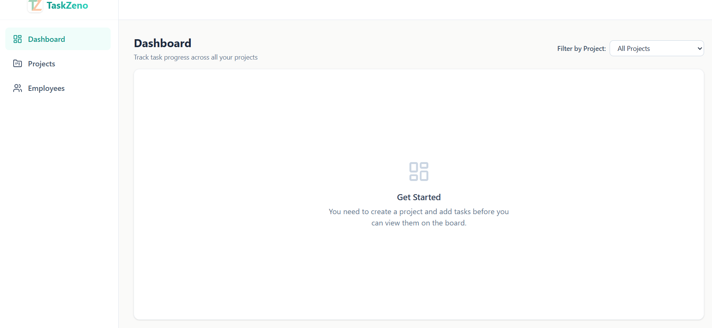
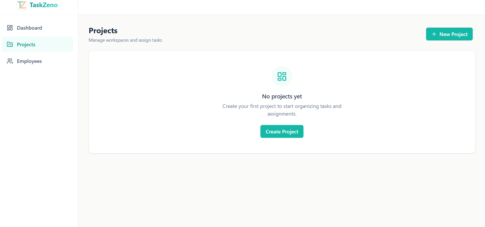
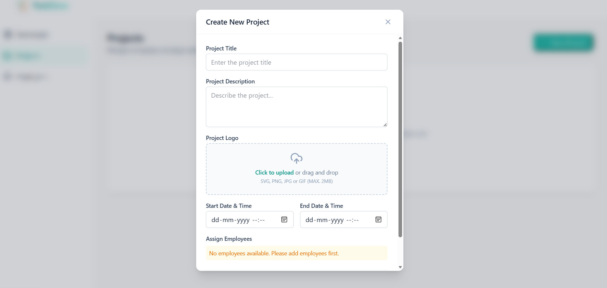
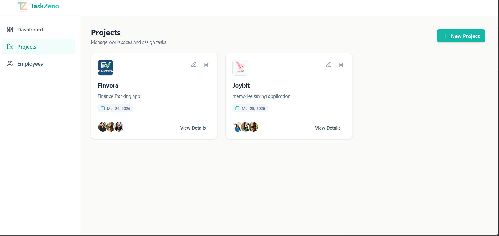
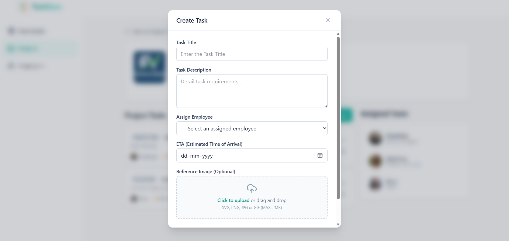
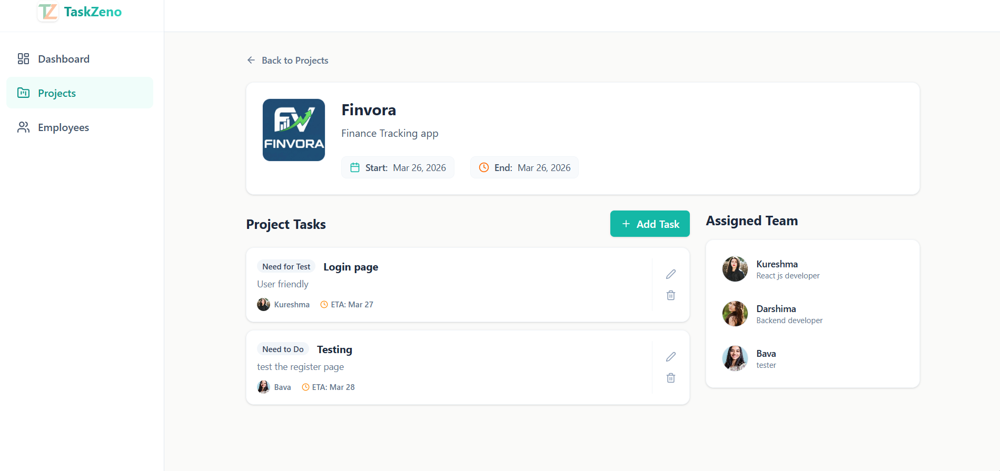
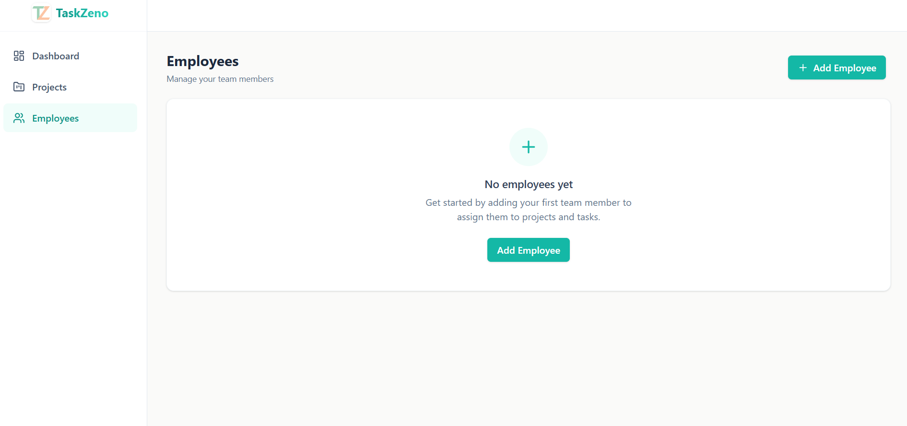
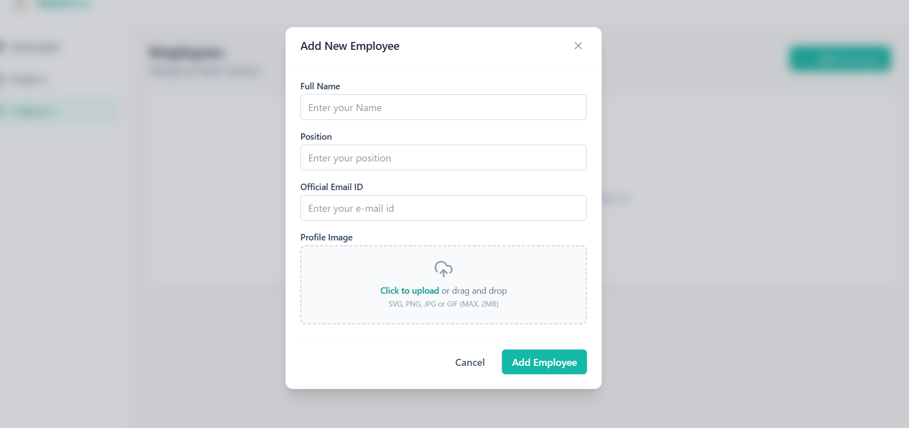
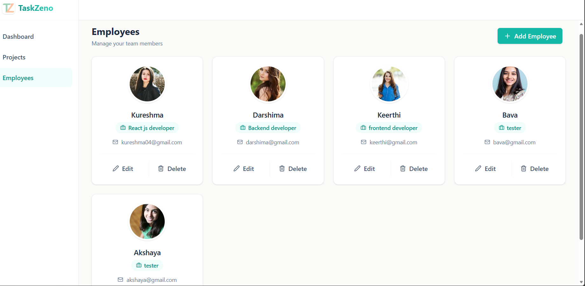

TaskZeno – Project Management Dashboard

Overview
TaskZeno is a modern project management dashboard built using React. It is designed to manage projects, tasks, and employees efficiently with a clean and scalable architecture. The application follows a component-based structure and uses state management for handling data across different modules.

Project Setup

1.Create the project:
npm create vite@latest taskzeno

2.Navigate to the project directory:
cd taskzeno

3.Install dependencies:
npm install

4.Start the development server:
npm run dev

Screenshots

Dashboard

Projects

Task Board

Employees

